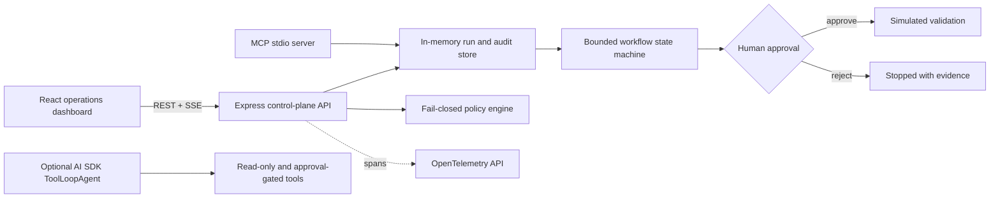

# RelayOps — Agentic Developer Operations Control Plane

[](https://github.com/m3yyyyy/agentic-developer-operations-control-plane/actions/workflows/ci.yml)

RelayOps is a production-style reference implementation for governing developer automation agents. It demonstrates a complete **observe → diagnose → propose → approve → validate → review** workflow while keeping the public demo safe: repository data is synthetic, proposed patches are virtual, unknown tools fail closed, and no shell or Git mutation capability is registered.

> **Reference implementation, not a production executor.** The architecture and contracts are real; external side effects are deliberately simulated.

## Live demo

- [Open the RelayOps dashboard](https://agentic-developer-operations-control.onrender.com)
- [Check the public health endpoint](https://agentic-developer-operations-control.onrender.com/api/health)

The deployed workflow has been verified end to end: new runs stop at the human approval checkpoint, approved simulations complete their validation and review stages, blocked capabilities remain unavailable, and decisions appear in the live audit stream.

## Why this project exists

Giving an AI model a shell is easy. Building a trustworthy operating layer around agents is the harder engineering problem. Teams need bounded execution, explicit tool policies, human checkpoints, isolated workspaces, live progress, and durable evidence.

RelayOps focuses on that control-plane layer:

- coordinates specialized planning stages instead of one opaque prompt;
- expresses access as `read-only`, `approval-required`, or `blocked`;
- pauses sensitive proposals for an explicit human decision;
- streams audit events to an operations dashboard;
- exposes safe read-only context through the official Model Context Protocol SDK;
- provides an optional AI SDK `ToolLoopAgent` adapter with a six-step limit;
- creates OpenTelemetry spans around run creation and approval decisions;
- remains useful locally and on Render without an AI provider key.

## Architecture



Detailed boundaries and trade-offs are documented in [Architecture](docs/architecture.md) and [Threat model](docs/threat-model.md).

## What to study

| Area | Implementation pattern |
| --- | --- |
| Agent loop | AI SDK `ToolLoopAgent` with `isStepCount(6)` to cap cost and runaway behavior |
| Tool safety | Allowlist plus fail-closed lookup; arbitrary shell and branch push are absent |
| Human-in-the-loop | State machine stops at `awaiting-approval`; the decision is validated server-side |
| Isolation | Every change proposal receives a `sim://worktrees/...` boundary |
| Interoperability | Official MCP SDK server exposes only read-only repository, run, and runbook tools |
| Live operations | Server-sent events refresh the dashboard when audit records are created |
| Observability | OpenTelemetry spans wrap state-changing control-plane operations |
| Verification | Strict TypeScript, Node test runner, production build, CI, and container build stage |

## Safe workflow

```text
Collect context → Diagnose → Draft proposal → HUMAN APPROVAL → Validate → Review evidence
```

The approval button does **not** change a real repository. It authorizes the simulator to complete its validation and review stages so the interaction can be studied safely.

## Local setup

Requirements: Node.js 22 or newer.

```powershell
npm install
npm run dev
```

Open `http://localhost:5173`. The API runs on `http://localhost:3100` and Vite proxies `/api` requests during development.

Run the full verification suite:

```powershell
npm run check
```

Build and start the production bundle:

```powershell
npm run build
npm start
```

Then open `http://localhost:3100`.

## MCP server

Start the local stdio server:

```powershell
npm run mcp
```

Example client configuration:

```json
{
  "mcpServers": {
    "relayops": {
      "command": "npm.cmd",
      "args": ["run", "mcp"],
      "cwd": "C:\\path\\to\\agentic-developer-operations-control-plane"
    }
  }
}
```

The MCP interface intentionally exposes only:

- `list_repositories`
- `inspect_run`
- `search_runbooks`

## Optional live model integration

The deployed dashboard uses a deterministic simulation and needs no model key. The adapter in `src/agent/developer-agent.ts` accepts an injected AI SDK `LanguageModel`, which keeps provider and model choice outside the repository.

If a real model is connected later, keep approval decisions on the server and configure a high-entropy `TOOL_APPROVAL_SECRET` to bind approvals cryptographically. Real execution also requires a hardened sandbox, authentication, tenant isolation, durable approval records, scoped credentials, and egress controls.

## API

| Method | Path | Purpose |
| --- | --- | --- |
| `GET` | `/api/health` | Service and simulation-mode health |
| `GET` | `/api/control-plane` | Repositories, policies, runs, events, and metrics |
| `GET` | `/api/runs/:runId` | One run with stages and decision evidence |
| `POST` | `/api/runs` | Create a bounded simulated run |
| `POST` | `/api/runs/:runId/decisions` | Approve or reject a waiting proposal |
| `GET` | `/api/events` | Live server-sent audit events |

## Deployment

`render.yaml` defines a Render Blueprint with:

- Blueprint/service name: `agentic-developer-operations-control-plane`
- Public URL: `https://agentic-developer-operations-control.onrender.com`
- Node.js 22 runtime
- `/api/health` health check
- production dependency pruning
- automatic deployment from `main`

The multi-stage Dockerfile builds and verifies the project, prunes development dependencies, and runs as a non-root user.

## Project structure

```text
src/
  agent/       optional AI SDK ToolLoopAgent adapter
  client/      React operations dashboard
  domain/      policy, state machine, catalog, and audit store
  mcp/         official MCP stdio server
  app.ts       Express routes and SSE stream
  server.ts    production entry point
tests/         policy and workflow state-machine tests
docs/          architecture and threat model
```

## Security boundary

The public demo does not:

- read a local Git checkout;
- execute arbitrary commands;
- access credentials or secrets;
- call external infrastructure APIs;
- push branches or open pull requests;
- persist approvals across process restarts.

Those omissions are intentional. See [SECURITY.md](SECURITY.md) before adapting the project.

## License

MIT
